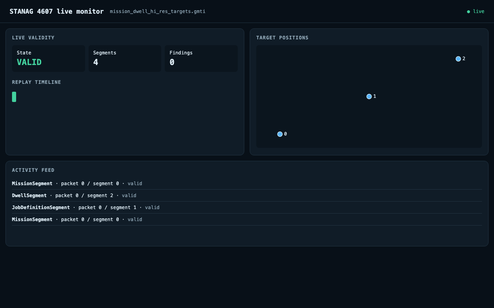

# Build with STANAG 4607 GMTI data

`stanag4607` reads, validates, preserves, and writes Ground Moving Target
Indicator (GMTI) packets in pure Python. Use it to inspect radar data, feed a
map or other application, and retain the time, position, uncertainty, and
provenance needed by a downstream sensor adapter.

The core has no required third-party Python dependencies. It accepts files or
arbitrarily chunked bytes supplied by your application, with explicit resource
limits and terminal truncation behavior.

## Start with a result

Clone the repository and install the package. The repository includes a small,
attributed synthetic packet with three located targets:

```console
git clone https://github.com/trane293/stanag4607.git
cd stanag4607
python -m pip install .
stanag4607 inspect tests/fixtures/mission_dwell_hi_res_targets.gmti
```

The last command prints one JSON line per segment. The Dwell line includes
`"target_count": 3` and a Mission-derived UTC timestamp. Follow the
[quickstart](QUICKSTART.md) to validate, export, and view the same file.



## Find your path

| Your task | Start here |
| --- | --- |
| Get a clean install and run the sample | [Installation](INSTALLATION.md) and [quickstart](QUICKSTART.md) |
| Use the Python API in an application | [Runnable examples](EXAMPLES.md) and [API reference](api/index.md) |
| Read chunks from a socket or other source | [Live streams and context](STREAMS.md) |
| Export located targets | [Target geometry and GeoJSON](GEOJSON.md) |
| Understand what the library actually supports | [Conformance](CONFORMANCE.md) and [limitations](LIMITATIONS.md) |
| Prepare an operational integration | [Production readiness](PRODUCTION_READINESS.md) |

The implemented baseline is STANAG 4607 Edition 4 / AEDP-4607 Edition A Version
1. The [conformance matrix](CONFORMANCE.md) shows supported fields, validation
rules, and test evidence. The [production-readiness guide](PRODUCTION_READINESS.md)
explains what to verify with a specific radar producer.

STANAG 4607 covers GMTI data; maritime AIS is a different standard.
